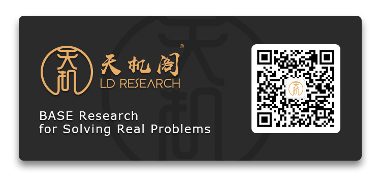

# LDResearch Developers Group

**LDResearch Developers Group** is a bridge connecting LDResearch with the vast number of open source enthusiasts and blockchain developers. It is an active technology exchange platform organized and built by LDResearch and the community. Through the offline national tour Meetup, hackathon, blockchain summit and online technical forums, live broadcasts, analysis columns and other activities, we create a developer community ecosystem on a global scale. At the same time, we sincerely invite excellent open source communities and projects such as blockchain, AI(Artificial Intelligence), and IoT (Internet of Things) to work with us to build a pragmatic, efficient, high-quality, spontaneous developer community alliance.

## Multi-Language

  

## LDResearch Wechat Official Account

## Blockchain National Tour Meetup

[7.28 Shanghai｜Embrace the future－Bring Blockchain To Everyone](meetup/shanghai)

[9.08 Beijing｜Blockchain Security technology salon](meetup/beijing)

## Development Guide

### Ethereum

[A guide to build up private ethereum blochain](guide/eth/manual.md)

