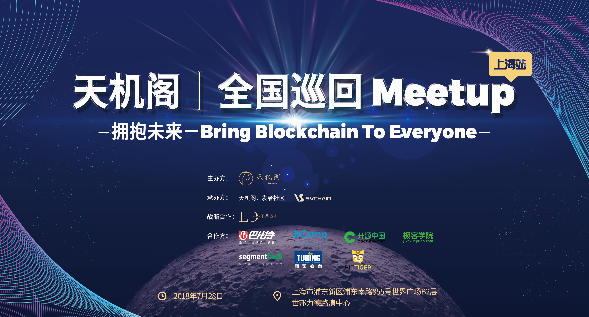
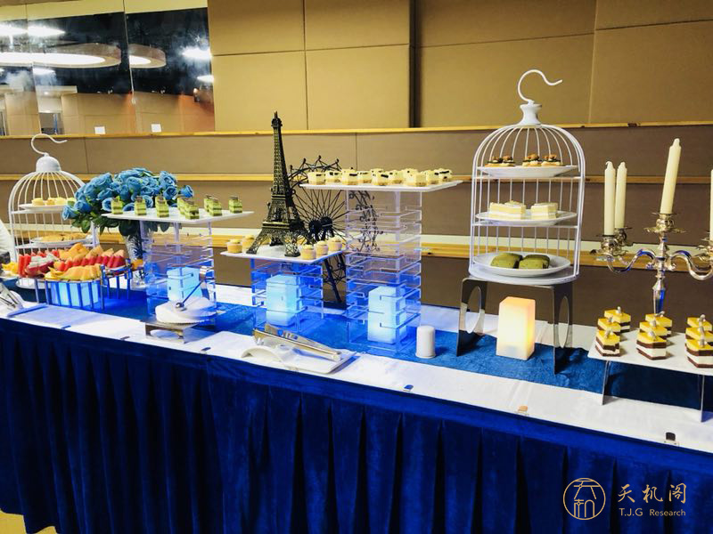

<!-- START doctoc generated TOC please keep comment here to allow auto update -->
<!-- DON'T EDIT THIS SECTION, INSTEAD RE-RUN doctoc TO UPDATE -->
**Table of Contents**  *generated with [DocToc](https://github.com/thlorenz/doctoc)*

- [天机阁全国巡回 Meetup 上海站](#%E5%A4%A9%E6%9C%BA%E9%98%81%E5%85%A8%E5%9B%BD%E5%B7%A1%E5%9B%9E-meetup-%E4%B8%8A%E6%B5%B7%E7%AB%99)
  - [活动介绍](#%E6%B4%BB%E5%8A%A8%E4%BB%8B%E7%BB%8D)
  - [讲师介绍](#%E8%AE%B2%E5%B8%88%E4%BB%8B%E7%BB%8D)
  - [活动社群](#%E6%B4%BB%E5%8A%A8%E7%A4%BE%E7%BE%A4)
  - [活动现场](#%E6%B4%BB%E5%8A%A8%E7%8E%B0%E5%9C%BA)
  - [精美茶歇](#%E7%B2%BE%E7%BE%8E%E8%8C%B6%E6%AD%87)
- [开发者福利](#%E5%BC%80%E5%8F%91%E8%80%85%E7%A6%8F%E5%88%A9)
  - [演讲嘉宾 PPT](#%E6%BC%94%E8%AE%B2%E5%98%89%E5%AE%BE-ppt)

<!-- END doctoc generated TOC please keep comment here to allow auto update -->

# 天机阁全国巡回 Meetup 上海站

**天机阁全国巡回 Meetup** 是由天机阁主办的面向开源社区贡献者和区块链技术开发者的线下技术沙龙活动，将在上海、北京、深圳、杭州、广州、成都等全国10个城市巡回展开。每一场 Meetup 都将邀请技术专家与行业大咖围绕**区块链、人工智能、物联网**等前沿技术进行深入分析解读，并与社区爱好者们分享**区块链落地场景与应用实践**。

## 活动介绍

2018年7月28日，天机阁迎来了第一站 **「T.J.G Meetup Shanghai」**。我们邀请到了来自5miles+Cybermiles 集团，Ruff Chain，PCHAIN，点融网，EOS生态区的技术专家同台，深度分享在区块链落地过程中踩过的坑、修过的bug、熬过的夜、获得的成长。

忠诚希望区块链相关从业者能够回归技术，不忘初心，聚焦区块链落地与应用服务，使人们能够真正感受到区块链技术的迷人魅力与独特优势。同时，我们也欢迎优秀的初创团队和个人在这个平台上展示最前沿的区块链技术应用。

## 讲师介绍

5miles+Cybermiles 集团 CTO丨**李新** 

**讲师简介**: 中国科技大学学士和美国爱荷华大学硕士学位，在加州大学UCLA开始互联网研究，后到硅谷任Arzoon架构师和eBay主管工程师等职，回国后曾任eBay中国研发中心高级研发经理、谷歌中国工程研究院（上海）技术总监、大众点评网高级技术总监、陆金所大数据和新技术部总经理、点点客CTO和大数据总经理等职。在传统电商、去中心化电商、搜索、广告、O2O、FinTech和互联网金融等领域有着丰富全面的互联网平台和大数据的研发和管理经验。

**演讲提纲**：传统电商提高了流通效率和用户体验，但其中心化做法造成了巨头垄断，中小商家和用户利益被平台绑架。支付基础设施的缺乏使得电商在各国发展不均衡，跨境电商成本高企。区块链通过token经济让平台、商家和用户共享利益，给电商带来新的红利，突破中心化瓶颈，降低支付门槛，保障商家和用户长期利益。Cybermiles 支持以太坊协议，并第一个专门为电商优化的基础区块链，提升了安全和性能，降低了开发成本，能够高效率处理复杂电商交易逻辑。

PCHAIN 创始人丨**曹锋**

**讲师简介**：中国第一个区块链国际专利发明人，ChinaLedger共同发起人，CFLP中物联区块链协会首席科学家。

**演讲提纲**：区块链3.0，是大规模区块链应用落地的时代，在公链高速发展的当下，核心技术成为了突破的关键。通过PDBFT新共识算法、知识图谱与Smart Data、跨链以及分片等技术的创新与融合，将如何有效解决目前区块链底层性能、数据不兼容、智能合约不闭环等诸多问题，加速区块链3.0的发展呢。

点融区块链实验室 资深架构师丨**刘辉**

**讲师简介**：曾在爱立信担任团队负责人和产品架构师，负责研发流媒体移动电视、以及LTE Broadcast系统；后加入EMC，带领团队研发EHC混合云；然后加入中泰证券担任系统架构师，研发大数据处理的中后台系统；目前在点融研发区块链云服务平台。

**演讲提纲**：点融区块链云服务平台为用户提供企业级的区块链基础设施，帮助用户轻松创建、管理区块链，快速开发、部署区块链应用。本次分享从业务系统上链时将要遇到的各项挑战出发，逐步深入解析点融区块链云服务平台的设计思路和实践经验。

EOS生态区 技术负责人丨邱绍锡

**讲师简介**：毕业于华东师范大学计算机专业，多年IT技术经验。深度参与EOS主网启动进程，开发EOS区块链浏览器、EOS离线签名工具。参加过大型银行核心系统建设，在金融科技相关领域有着丰富经验。Bitshares、EOS社区早期参与者，对石墨烯框架有深入研究。超级账本Hyperledger中国社区早期参与者，负责过多个区块链落地项目。

**演讲提纲**：EOS主网正式启动，但是相关工具还不成熟。浏览器是了解一个区块链项目的入口，在浏览器中可以看到用户的转账记录，区块、交易、账户等信息。区块链的公开透明的特性也只有在浏览器中才能得到展现。EOS相对于现有的比特币和以太坊，架构上有很多不同的地方，在浏览器中也能够看到很多不同的内容。最明显的就是投票展示的内容，还有包括系统资源占用和价格等信息都是全新的概念。本次分享旨在通过分析区块链基础数据格式来让受众对EOS有更多的理解和思考

 

## 活动社群

长按加客服 进入讨论群

## 活动现场

## 精美茶歇

# 开发者福利

## 演讲嘉宾 PPT

[天机阁-CyberMiles-区块链开启新电商生态](slides/天机阁-CyberMiles-区块链开启新电商生态.pdf)

[天机阁-PCHAIN-区块链3.0的核心技术](天机阁-PCHAIN-区块链3.0的核心技术.pdf)

[天机阁-点融网-深度解析点融区块链云服务](天机阁-点融网-深度解析点融区块链云服务.pdf)

[天机阁-EOSeco-从浏览器看到EOS](slides/天机阁-EOSeco-从浏览器看到EOS.pdf)

